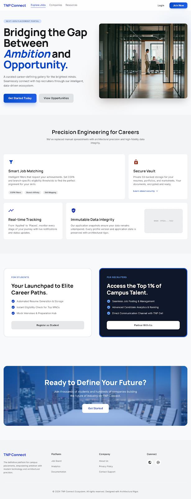
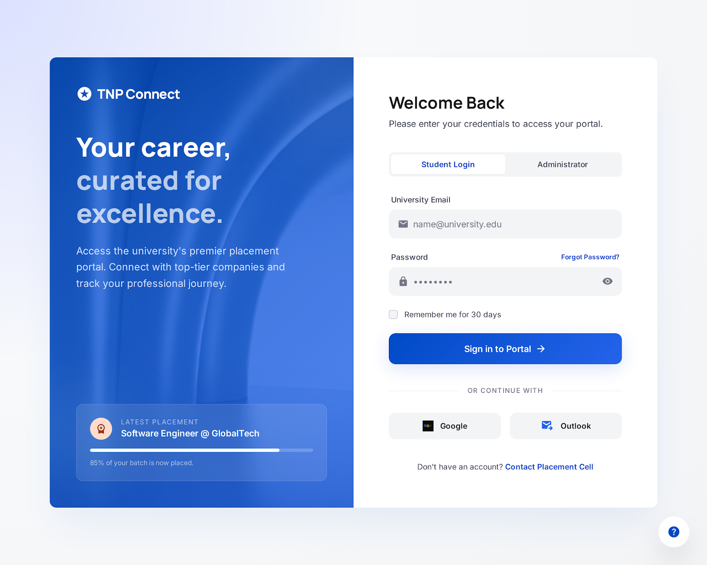
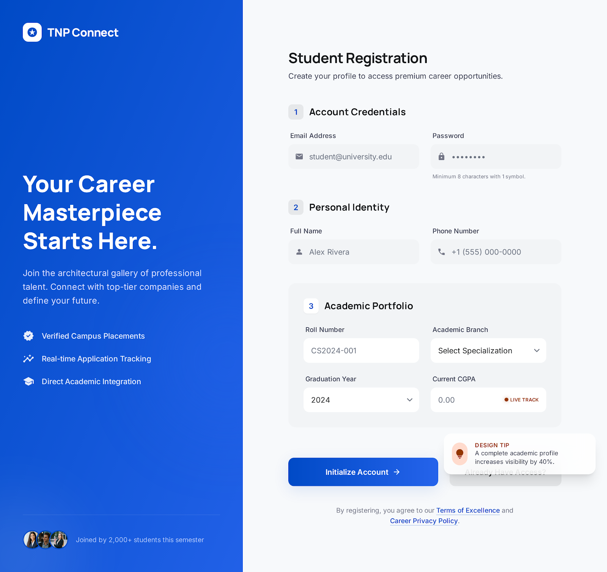
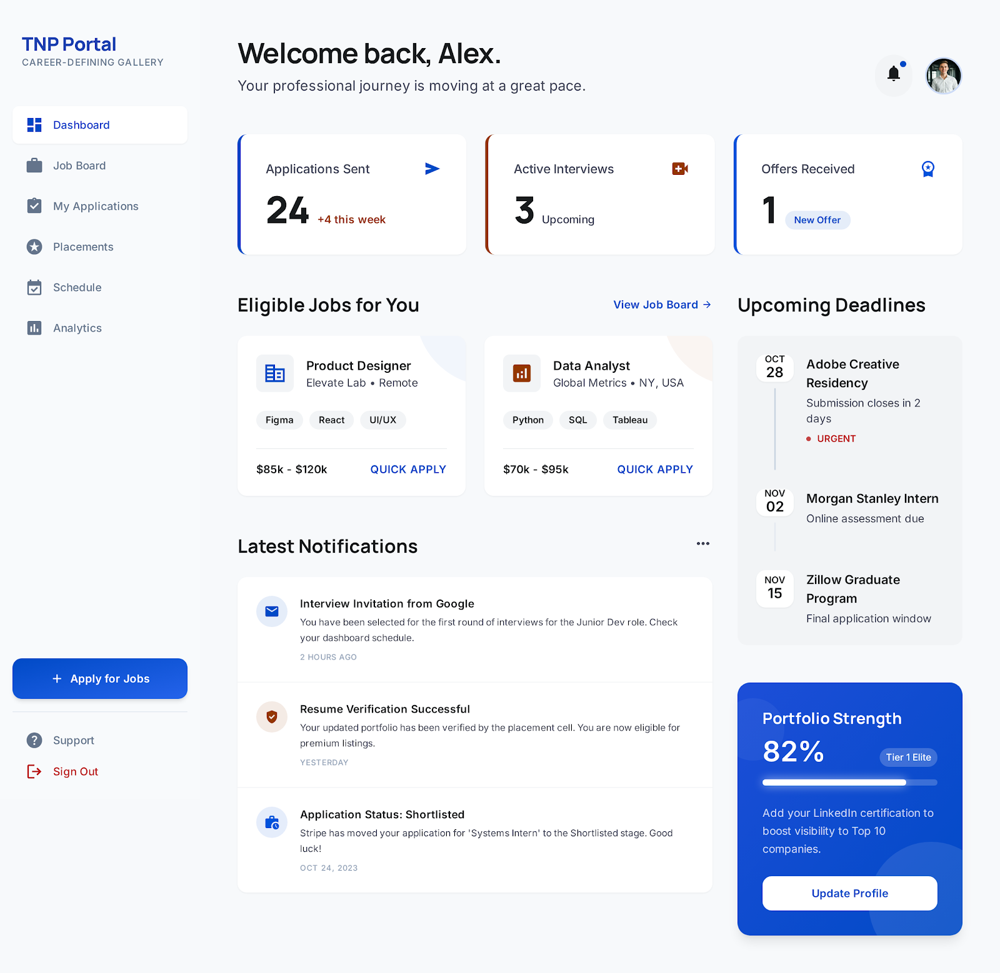
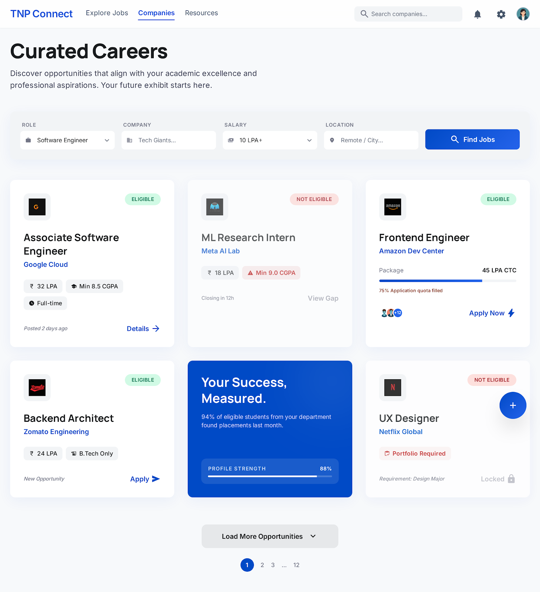
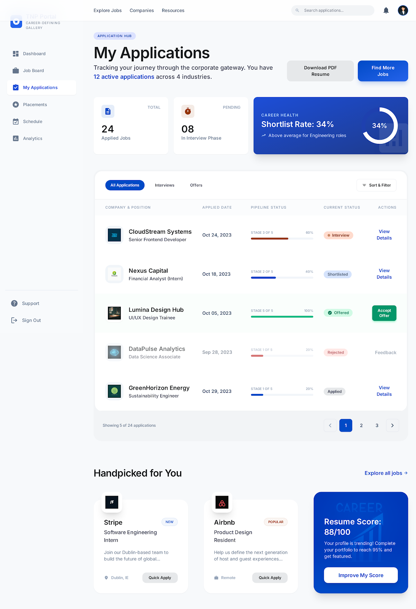
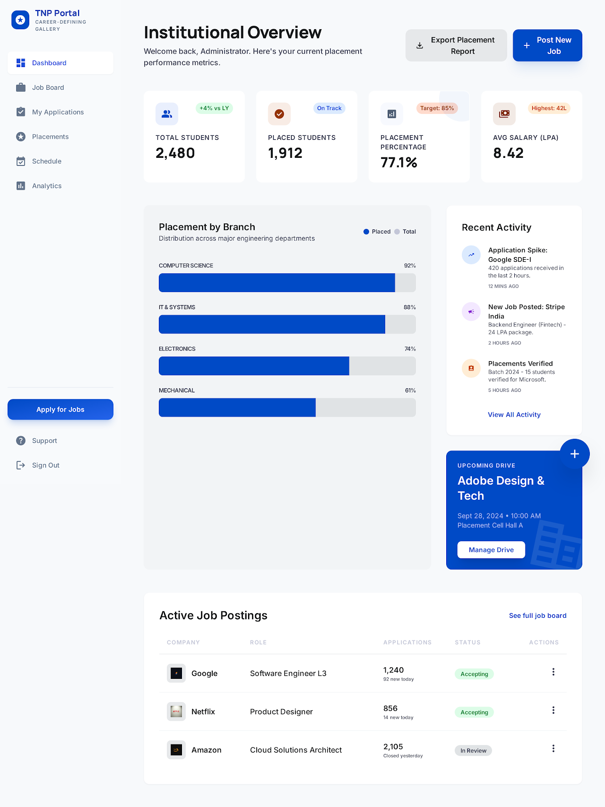
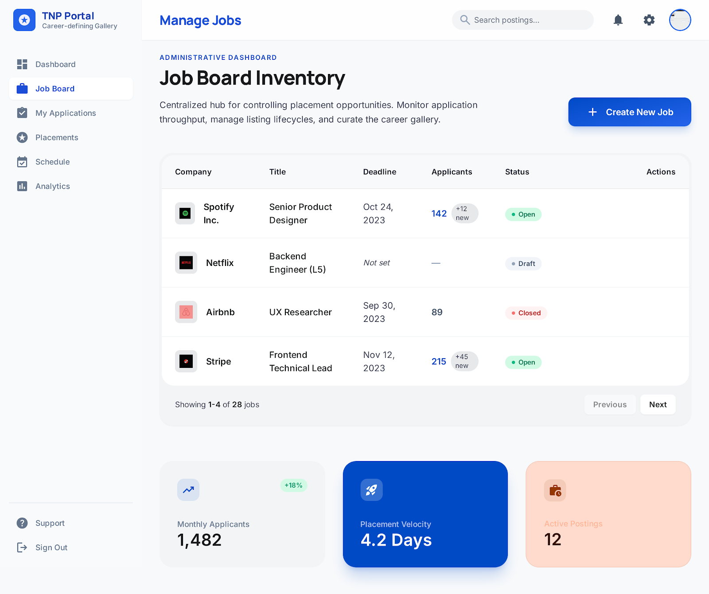
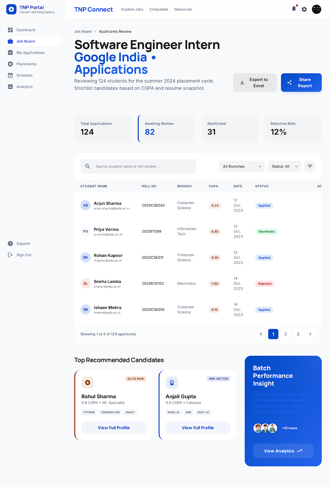

# TNP Connect — Training & Placement Platform

> A full-stack campus recruitment platform that connects students with placement opportunities through a smart job board, document vault, intelligent eligibility engine, and a rich admin operations console.

[](https://react.dev)
[](https://nodejs.org)
[](https://postgresql.org)
[](https://aws.amazon.com)
[](https://tailwindcss.com)
[](https://www.framer.com/motion)

---

## Live Demo

| Surface | URL |
|---------|-----|
| Frontend | [d3n0if71dkljcl.cloudfront.net](https://d3n0if71dkljcl.cloudfront.net) |
| Backend API | `https://d3n0if71dkljcl.cloudfront.net/api/v1` (via CloudFront proxy → EC2) |

---

## Implementation Status (Verified from Codebase)

Last verified: **17 April 2026**

### Core Modules Implemented
- **Auth + RBAC**: JWT access (2h) + refresh (7d), setup/reset password via token, role-based protection for student/admin.
- **Student Profile System**: profile CRUD, skills update, certifications/work experience CRUD, profile completeness tracking.
- **Job Discovery + Eligibility**: student job listing with hard eligibility evaluation and reasons; admin job lifecycle (draft/open/closed/completed).
- **Application Pipeline**: apply flow with immutable snapshot data, duplicate prevention, resume change support, per-application detail view.
- **Document Vault**: S3-backed uploads with MIME validation (PDF/JPEG/PNG), primary resume support, signed access links, access logs.
- **Admin Operations**: applicant review, status updates, interview round scheduling, student management, JD quality checker.
- **Analytics + Export**: admin analytics endpoints and Excel export for applicants.
- **Company Operations Console**: outreach status pipeline, SLA indicators, timeline events, contact logs.
- **Notifications + Cron**: in-app notifications and daily deadline reminder cron (09:00 Asia/Kolkata).
- **Audit Trail**: audit tables and APIs with active writes on applicant status updates and company updates.

### Scope Notes
- Email sending is implemented through **AWS SES SDK** in backend services.
- Cron currently includes the **deadline reminder job** (no additional periodic jobs yet).
- Company and audit features are implemented in backend and frontend admin pages.

---

## Screenshots

<table>
  <tr>
    <td align="center"><b>Landing Page</b></td>
    <td align="center"><b>Login</b></td>
  </tr>
  <tr>
    <td></td>
    <td></td>
  </tr>
  <tr>
    <td align="center"><b>Student Registration</b></td>
    <td align="center"><b>Student Dashboard</b></td>
  </tr>
  <tr>
    <td></td>
    <td></td>
  </tr>
  <tr>
    <td align="center"><b>Job Board</b></td>
    <td align="center"><b>My Applications</b></td>
  </tr>
  <tr>
    <td></td>
    <td></td>
  </tr>
  <tr>
    <td align="center"><b>Admin Dashboard</b></td>
    <td align="center"><b>Manage Jobs</b></td>
  </tr>
  <tr>
    <td></td>
    <td></td>
  </tr>
  <tr>
    <td align="center"><b>Applicants Review</b></td>
    <td align="center"><b>Profile</b></td>
  </tr>
  <tr>
    <td></td>
    <td></td>
  </tr>
</table>

---

## Features

### Student Portal
- **Smart Job Board** — Browse jobs with eligibility status (CGPA, branch, backlogs) and switch to an eligible-only view.
- **One-Click Apply with Resume Selection** — Always shows a resume picker at apply time; links to Document Vault if no resume is uploaded yet.
- **Immutable Snapshots** — Application snapshots are frozen at submission time; profile edits never affect pending applications.
- **Document Vault** — Upload resumes, marksheets, certificates, and more to AWS S3. Set a primary resume. Supports PDF, PNG, JPG (max 5 MB each) with a two-stage confirm-before-upload flow.
- **Application Tracker** — Detailed application status page with phase breadcrumb (Applied → Shortlisted → Interview → Offer), interview round results, and attached resume display.
- **Real-time Notifications** — Deadline reminders and status-change alerts with a portal-rendered dropdown that escapes all CSS stacking contexts.
- **Animated UI** — Framer Motion particles, parallax cards, animated stats counters, and staggered entrance animations across all pages.

### Admin / Placement Cell

- **Post Jobs with JD Quality Checker** — Inline quality score (0–100) validates salary, branches, CGPA threshold, deadline, selection rounds, description depth, and flags vague language before publish. Hard errors block publishing.
- **Hard Eligibility vs Fit Score** — Branch, CGPA, and backlog criteria are hard gates applied before scoring. Fit score (0–100) is computed only for eligible candidates using skills, certifications, and experience. Ineligible applicants show "N/A" and their specific fail reasons.
- **Applicants Review Board** — Filterable by status and eligibility tier (all / eligible only / failed hard filters). Each card shows eligibility badge, hard-failure reasons, and fit score.
- **Audit Trail** — Every status change records who changed what, from which value to which, with an optional written reason. Viewable per-applicant via an "Audit" button.
- **Company Operations Console** — Unified dashboard for all companies:
  - Outreach status pipeline (Not Started → In Progress → JD Received → Approved → Drive Scheduled → Completed)
  - SLA tracker: flags companies as On Track / Due Soon / Overdue based on last contact date and configurable SLA days
  - Timeline events (outreach, JD received, drive scheduled, results published, etc.)
  - Contact history log (email, call, WhatsApp, meeting, visit) — prevents repeated contacts by different coordinators
  - Linked role list with applicant counts
- **Excel Export** — Download per-job applicant data as a formatted `.xlsx` report.
- **Placement Analytics** — Charts for placement rates, package distributions, branch-wise stats, monthly trends.
- **Student Management** — Create, edit, and deactivate student accounts; send password setup and reset links via email.
- **Interview Scheduling** — Schedule and record multiple interview rounds (pass/fail/pending) per application.

### Platform
- **JWT Auth** — Access tokens (2h) + refresh tokens (7d) with secure rotation and auto-refresh interceptor.
- **RBAC** — Student and Admin roles with protected routes on both frontend and backend.
- **Responsive App Shell** — Fixed shell with no page-level scroll; animated sidebar and page transitions via Framer Motion.
- **Portal-Rendered Notification Dropdown** — Uses `ReactDOM.createPortal` + `getBoundingClientRect` to render above all stacking contexts regardless of page.

---

## Tech Stack

| Layer | Technology |
|-------|-----------|
| **Frontend** | React 18, Vite 5, React Router v6 |
| **State / Data** | Zustand, TanStack React Query v5 |
| **UI / Styling** | Tailwind CSS (Material Design 3 tokens), Lucide icons |
| **Animations** | Framer Motion (particles, parallax, scroll-triggered counters) |
| **Charts** | Recharts |
| **Forms** | React Hook Form + Zod |
| **Backend** | Node.js, Express.js |
| **Database** | PostgreSQL (RDS 15+ in AWS, 16 in local Docker) |
| **Auth** | JWT (jsonwebtoken), bcryptjs |
| **File Storage** | AWS S3 + pre-signed GET URLs |
| **Email** | AWS SES (AWS SDK v3) |
| **Scheduled Jobs** | node-cron |
| **Excel Export** | ExcelJS |
| **Validation** | Joi (backend), Zod (frontend) |
| **Infra** | AWS EC2 (backend), AWS S3 + CloudFront (frontend) |

---

## Architecture

```
Browser (HTTPS)
      │
      ▼
┌─────────────────────────────┐
│  AWS CloudFront CDN         │
│  d3n0if71dkljcl.cloudfront  │
│                             │
│  /*      → S3 Bucket        │  ← React SPA (Vite build)
│  /api/*  → EC2 Origin       │  ← Express API (port 80)
└─────────────────────────────┘
      │
      ▼
┌────────────────────────────────┐
│  AWS EC2 (Node.js / Express)   │
│                                │
│  /api/v1/auth/*                │
│  /api/v1/students/*            │
│  /api/v1/jobs/*                │
│  /api/v1/applications/*        │
│  /api/v1/documents/*           │
│  /api/v1/admin/*               │
│  /api/v1/notifications/*       │
│  /api/v1/companies/*           │  ← Company Operations Console
└──────────────┬─────────────────┘
               │
    ┌──────────┴──────────┐
    ▼                     ▼
PostgreSQL 15          AWS S3
(Users, Jobs,       (Resumes &
 Applications,       Documents)
 Documents,
 Notifications,
 Audit Logs,
 Company Timeline,
 Contact History)
```

---

## Database Schema

The platform uses **3 migration files** that build up the full schema:

| Migration | Tables Created |
|-----------|---------------|
| `001_schema.sql` | `users`, `refresh_tokens`, `student_profiles`, `certifications`, `work_experiences`, `documents`, `document_access_logs`, `companies`, `jobs`, `applications`, `interview_rounds`, `notifications` |
| `002_password_reset_tokens.sql` | `password_reset_tokens` |
| `003_features.sql` | `audit_logs`, `company_contacts`, `company_timeline_events`; adds `outreach_status`, `sla_days`, `last_contacted_at`, `next_followup_at`, `assigned_coordinator`, `notes` to `companies` |

---

## Getting Started

### Prerequisites

- Node.js 18+
- PostgreSQL 15+
- AWS account (S3 bucket + SES, optional for local dev)

### 1. Clone

```bash
git clone https://github.com/your-username/tnp-connect.git
cd tnp-connect
```

### 2. Backend Setup

```bash
cd backend
npm install
cp .env.example .env
# Fill in your DB credentials, JWT secrets, and AWS keys in .env
```

Run database migrations and seed demo data:

```bash
npm run migrate   # Creates all tables (runs all 3 migration files)
npm run seed      # Seeds TnP admin credentials and demo data
```

Start the backend:

```bash
npm run dev       # Development (hot reload via --watch)
npm start         # Production
```

### 3. Frontend Setup

```bash
cd frontend
npm install
cp .env.example .env
# Set VITE_API_BASE_URL=http://localhost:5000/api/v1 for local dev
npm run dev
```

### 4. Open

```
Frontend: http://localhost:5173
Backend:  http://localhost:5000/api/v1
```

---

## Environment Variables

### Backend (`backend/.env`)

```env
# Server
PORT=5000

# Frontend origin for CORS
FRONTEND_URL=https://your-cloudfront-domain.cloudfront.net

# JWT
JWT_SECRET=your-long-random-secret
JWT_REFRESH_SECRET=your-long-random-refresh-secret

# PostgreSQL
DB_HOST=localhost
DB_PORT=5432
DB_NAME=tnp_platform
DB_USER=postgres
DB_PASSWORD=yourpassword
DB_SSL=false

# AWS S3 (document storage)
AWS_REGION=ap-south-1
AWS_ACCESS_KEY_ID=your-key-id
AWS_SECRET_ACCESS_KEY=your-secret-key
S3_BUCKET_NAME=tnp-platform

# Email (AWS SES or SMTP)
SES_FROM_EMAIL=noreply@yourdomain.com

# Cron
DISABLE_CRON=false
```

### Frontend (`frontend/.env`)

```env
# Local dev
VITE_API_BASE_URL=http://localhost:5000/api/v1
```

### Frontend (`frontend/.env.production`)

```env
# Production — route through CloudFront to avoid mixed content
VITE_API_BASE_URL=https://your-cloudfront-domain.cloudfront.net/api/v1
```

---

## API Overview

### Authentication
| Method | Endpoint | Auth | Description |
|--------|----------|------|-------------|
| `POST` | `/auth/login` | Public | Student (enrollmentNo) or admin (email) login |
| `POST` | `/auth/setup-password` | Public | First-time password setup via emailed token |
| `POST` | `/auth/reset-password` | Public | Password reset via emailed token |
| `POST` | `/auth/refresh` | Public | Rotate access token using refresh token |
| `POST` | `/auth/logout` | Public | Revoke refresh token (when provided) |
| `GET` | `/auth/me` | Auth | Current user info |

### Student
| Method | Endpoint | Auth | Description |
|--------|----------|------|-------------|
| `GET` | `/students/me/dashboard` | Student | Dashboard stats |
| `GET/PUT` | `/students/me/profile` | Student | View / update profile |
| `PUT` | `/students/me/profile/skills` | Student | Update skills array |
| `GET/POST/PUT/DELETE` | `/students/me/work-experiences` | Student | Work experience CRUD |
| `GET/POST/PUT/DELETE` | `/students/me/certifications` | Student | Certifications CRUD |

### Jobs
| Method | Endpoint | Auth | Description |
|--------|----------|------|-------------|
| `GET` | `/jobs` | Auth | Job listing enriched with eligibility evaluation |
| `GET` | `/jobs/:id` | Auth | Job detail with eligibility check |

### Applications
| Method | Endpoint | Auth | Description |
|--------|----------|------|-------------|
| `GET` | `/applications` | Student | My applications (status filter) |
| `POST` | `/applications` | Student | Apply (freezes snapshot + computes fit score) |
| `GET` | `/applications/:id` | Student | Application detail with interview rounds |
| `PATCH` | `/applications/:id/resume` | Student | Change attached resume before deadline |

### Documents
| Method | Endpoint | Auth | Description |
|--------|----------|------|-------------|
| `GET` | `/documents` | Student | List my documents |
| `POST` | `/documents/upload` | Student | Upload file to S3 (PDF/PNG/JPG, max 5 MB) |
| `PATCH` | `/documents/:id/primary` | Student | Set as primary resume |
| `GET` | `/documents/:id/access` | Student | Generate pre-signed download URL |

### Notifications
| Method | Endpoint | Auth | Description |
|--------|----------|------|-------------|
| `GET` | `/notifications` | Auth | Notification feed |
| `GET` | `/notifications/unread-count` | Auth | Unread count badge |
| `POST` | `/notifications/read-all` | Auth | Mark all as read |
| `PATCH` | `/notifications/:id/read` | Auth | Mark single as read |
| `DELETE` | `/notifications/:id` | Auth | Delete notification |

### Admin — Jobs & Applicants
| Method | Endpoint | Auth | Description |
|--------|----------|------|-------------|
| `GET` | `/admin/jobs` | Admin | All jobs with applicant counts |
| `POST` | `/admin/jobs` | Admin | Create job posting |
| `POST` | `/admin/jobs/validate` | Admin | JD quality check (returns score + warnings) |
| `PUT` | `/admin/jobs/:id` | Admin | Edit job |
| `POST` | `/admin/jobs/:id/close` | Admin | Close applications |
| `POST` | `/admin/jobs/:id/reopen` | Admin | Reopen applications |
| `DELETE` | `/admin/jobs/:id` | Admin | Delete (only if no applicants) |
| `GET` | `/admin/jobs/:id/applicants` | Admin | Applicants with eligibility flags + fit scores |
| `GET` | `/admin/jobs/:id/export` | Admin | Excel download |
| `PATCH` | `/admin/jobs/:id/applicants/:applicantId` | Admin | Update status (accepts optional `reason` for audit) |

### Admin — Analytics, Students & Audit
| Method | Endpoint | Auth | Description |
|--------|----------|------|-------------|
| `GET` | `/admin/dashboard` | Admin | Overview stats + recent activity |
| `GET` | `/admin/analytics` | Admin | Placement charts data |
| `GET` | `/admin/audit-logs` | Admin | Audit trail (filter by entityType, entityId) |
| `GET` | `/admin/students` | Admin | Paginated student list with search |
| `POST` | `/admin/students` | Admin | Create student account |
| `PUT` | `/admin/students/:id` | Admin | Edit student details |
| `POST` | `/admin/students/:id/send-setup-link` | Admin | Email password setup link |
| `POST` | `/admin/students/:id/send-reset-link` | Admin | Email password reset link |

### Companies
| Method | Endpoint | Auth | Description |
|--------|----------|------|-------------|
| `GET` | `/companies` | Admin | All companies (with SLA status) |
| `POST` | `/companies` | Admin | Create company |
| `GET` | `/companies/:id` | Admin | Company detail + timeline + contacts + jobs |
| `PATCH` | `/companies/:id` | Admin | Update outreach status, SLA days, coordinator |
| `POST` | `/companies/:id/timeline` | Admin | Add timeline event |
| `POST` | `/companies/:id/contacts` | Admin | Log a contact interaction |

### Interviews
| Method | Endpoint | Auth | Description |
|--------|----------|------|-------------|
| `GET` | `/admin/applications/:appId/rounds` | Admin | Interview rounds for application |
| `POST` | `/admin/applications/:appId/rounds` | Admin | Schedule new round |
| `PATCH` | `/admin/applications/:appId/rounds/:id` | Admin | Update round result (pass/fail/pending) |

---

## Project Structure

```
tnp-connect/
├── frontend/
│   ├── src/
│   │   ├── pages/
│   │   │   ├── LandingPage.jsx          # Animated hero + stats + parallax cards
│   │   │   ├── auth/
│   │   │   │   ├── LoginPage.jsx        # Role toggle, animated left panel with particles
│   │   │   │   ├── RegisterPage.jsx     # 3-section form with animated left panel
│   │   │   │   ├── SetupPasswordPage.jsx
│   │   │   │   └── ResetPasswordPage.jsx
│   │   │   ├── student/
│   │   │   │   ├── Dashboard.jsx
│   │   │   │   ├── ProfilePage.jsx
│   │   │   │   ├── JobBoardPage.jsx
│   │   │   │   ├── JobDetailPage.jsx    # Always-visible resume picker
│   │   │   │   ├── MyApplicationsPage.jsx
│   │   │   │   ├── ApplicationDetailPage.jsx  # Status breadcrumb + rounds
│   │   │   │   ├── DocumentVaultPage.jsx      # Set primary resume
│   │   │   │   └── NotificationsPage.jsx
│   │   │   └── admin/
│   │   │       ├── Dashboard.jsx
│   │   │       ├── PostJobPage.jsx            # JD quality checker
│   │   │       ├── EditJobPage.jsx
│   │   │       ├── ManageJobsPage.jsx
│   │   │       ├── ApplicantsPage.jsx         # Eligibility tabs + audit drawer + reason modal
│   │   │       ├── CompanyConsolePage.jsx     # SLA tracker + timeline + contacts
│   │   │       ├── ManageStudentsPage.jsx
│   │   │       └── PlacementAnalyticsPage.jsx
│   │   ├── components/
│   │   │   ├── FloatingParticles.jsx    # Animated particle + orb background
│   │   │   ├── NotificationBell.jsx    # Portal-rendered dropdown
│   │   │   ├── FileUploader.jsx        # Two-stage upload with type picker
│   │   │   ├── InterviewModal.jsx
│   │   │   ├── ApplicationStatusBadge.jsx
│   │   │   ├── JobCard.jsx
│   │   │   ├── ShellHeader.jsx
│   │   │   ├── ShellSidebar.jsx
│   │   │   └── ui/
│   │   │       ├── Button.jsx
│   │   │       ├── SurfaceCard.jsx
│   │   │       └── SectionHeading.jsx
│   │   ├── hooks/
│   │   │   ├── useAuth.js
│   │   │   ├── useStudent.js
│   │   │   ├── useJobs.js
│   │   │   ├── useApplications.js
│   │   │   ├── useAdmin.js             # + useAuditLogs, useValidateJD
│   │   │   ├── useCompany.js           # Company Console hooks
│   │   │   ├── useInterviews.js
│   │   │   └── useNotifications.js
│   │   ├── layouts/
│   │   │   ├── StudentLayout.jsx
│   │   │   └── AdminLayout.jsx         # Companies nav item added
│   │   ├── store/
│   │   │   └── authStore.js
│   │   └── lib/
│   │       ├── apiClient.js
│   │       ├── utils.js
│   │       └── jdChecker.js            # Client-side JD quality scoring
│   └── .env.production
│
├── backend/
│   ├── src/
│   │   ├── controllers/
│   │   │   ├── auth.controller.js
│   │   │   ├── student.controller.js
│   │   │   ├── job.controller.js
│   │   │   ├── application.controller.js
│   │   │   ├── document.controller.js
│   │   │   ├── interview.controller.js
│   │   │   ├── notification.controller.js
│   │   │   ├── admin.controller.js     # + validateJD, getEntityAuditLogs, eligibility in getApplicants
│   │   │   └── company.controller.js   # Company Console CRUD
│   │   ├── routes/
│   │   │   ├── auth.routes.js
│   │   │   ├── student.routes.js
│   │   │   ├── job.routes.js
│   │   │   ├── application.routes.js
│   │   │   ├── document.routes.js
│   │   │   ├── interview.routes.js
│   │   │   ├── notification.routes.js
│   │   │   ├── admin.routes.js         # + /validate, /audit-logs
│   │   │   └── company.routes.js       # New
│   │   ├── services/
│   │   │   ├── criteriaEngine.service.js  # Hard filters separated from fit score
│   │   │   ├── audit.service.js           # createAuditLog, getAuditLogs
│   │   │   ├── jdChecker.service.js       # JD quality validation
│   │   │   ├── application.service.js
│   │   │   ├── presentation.service.js
│   │   │   ├── token.service.js
│   │   │   ├── email.service.js
│   │   │   ├── s3.service.js
│   │   │   └── export.service.js
│   │   ├── middleware/
│   │   │   ├── auth.middleware.js
│   │   │   ├── validate.middleware.js
│   │   │   ├── upload.middleware.js
│   │   │   └── errorHandler.js
│   │   ├── db/
│   │   │   ├── index.js
│   │   │   ├── pool.js
│   │   │   ├── migrate.js
│   │   │   └── migrations/
│   │   │       ├── 001_schema.sql
│   │   │       ├── 002_password_reset_tokens.sql
│   │   │       └── 003_features.sql    # Audit logs + company operations tables
│   │   ├── validators/
│   │   │   ├── auth.validator.js
│   │   │   ├── job.validator.js
│   │   │   └── student.validator.js
│   │   └── jobs/
│   │       └── cronJobs.js
│   └── .env
│
└── README.md
```

---

## Deployment

See [DEPLOYMENT.md](./DEPLOYMENT.md) for full AWS deployment instructions covering:
- Building the React app and uploading to S3
- Configuring CloudFront (SPA routing + `/api/*` proxy behavior)
- Running the backend on EC2 with PM2
- Setting up PostgreSQL on EC2 or RDS
- Configuring CORS and environment variables

---

## Changelog

### Latest — v1.4.0
- **Audit Trail** — Every applicant status change is logged with actor, old/new values, timestamp, IP, and optional written reason. Viewable per-application from the admin panel.
- **Company Operations Console** — New admin page with outreach pipeline, SLA tracker, contact history, and timeline events per company.
- **JD Quality Checker** — Live quality score (0–100) in the Post Job form. Blocks publishing if required fields (salary, branches, deadline) are missing.
- **Hard Eligibility vs Fit Score** — Eligibility (branch/CGPA/backlogs) is a hard gate. Fit score is only computed and shown for candidates who pass all hard filters.
- **Eligibility Segmented Filter** — Applicants board now has "Eligible only" and "Failed hard filters" tabs with per-applicant fail-reason display.

### v1.3.0
- Animated **LandingPage** with Framer Motion particles, parallax cards, animated stat counters, and company chip stagger.
- Animated **LoginPage** and **RegisterPage** with floating particles, animated orbs, staggered form sections.
- **Notification Bell** rewritten with `ReactDOM.createPortal` to escape CSS stacking contexts.
- **Application Detail Page** with status breadcrumb, interview round cards, and resume attachment display.

### v1.2.0
- **Document Vault** — Two-stage file upload (select type before confirming). Set primary resume button.
- **Resume picker in Job Detail** — Always visible at apply time; prompts upload if no resume exists.
- **Add Student form** validation fixed — `mode: "onChange"`, `defaultValues`, `valueAsNumber` for CGPA.
- **404 fix** for `GET /applications/:id` — new route and controller added.

### v1.1.0
- CI/CD pipeline via GitHub Actions.
- Student login flow and field locking on profile.
- AWS S3 upload with structured error logging.

---

## License

This project is developed for academic/institutional use.  
© 2026 TNP Connect. All rights reserved.
