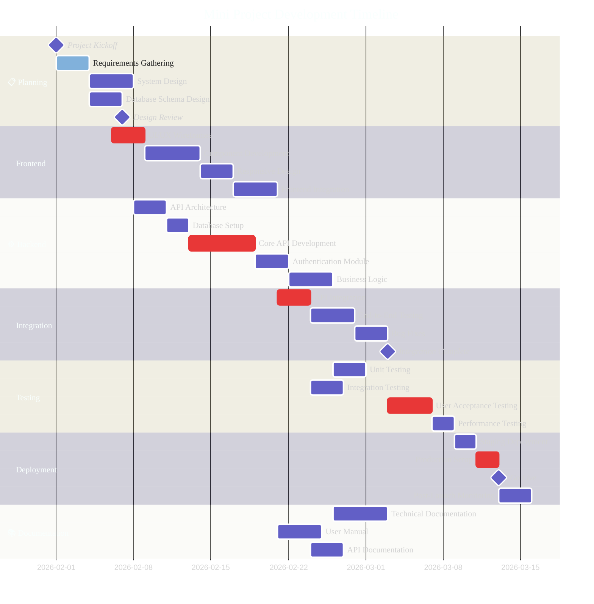
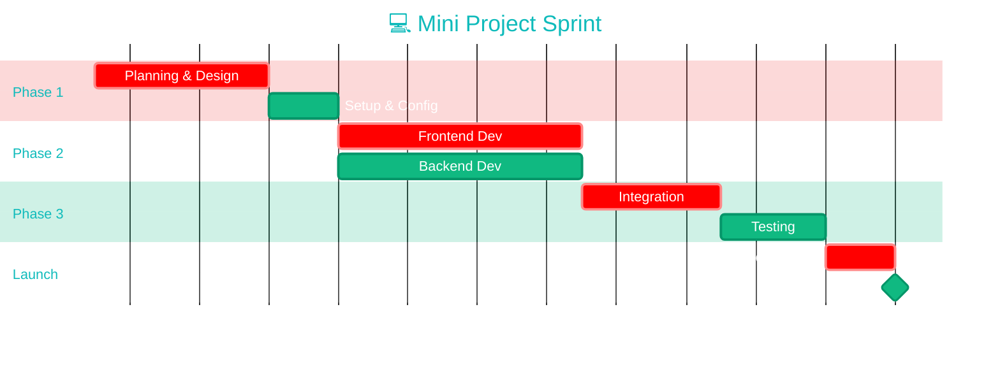

# 🚀 Mini Project - Development Timeline

This document contains a visual Gantt chart representation of the project timeline using Mermaid diagrams.

## 📊 Project Gantt Chart

## 🎯 Alternative Compact Version

For a simpler, more condensed view:

## 📝 Customization Guide

### Change Theme
Replace `'theme':'dark'` with:
- `'theme':'default'` - Light theme
- `'theme':'forest'` - Green theme
- `'theme':'neutral'` - Gray theme
- `'theme':'base'` - Minimal theme

### Adjust Dates
Modify dates in `YYYY-MM-DD` format to match your project timeline.

### Task Types
- **Critical tasks**: Add `:crit` tag to highlight important tasks
- **Active tasks**: Add `:active` tag for currently running tasks
- **Milestones**: Add `:milestone` tag for key checkpoints

### Dependencies
- Use `after taskId` to create task dependencies
- Example: `Task B :after taskA, 3d`

### Duration
Change the number followed by `d` (days):
- `2d` = 2 days
- `1w` = 1 week
- `2w` = 2 weeks

## 🛠️ How to View

1. **GitHub/GitLab**: These platforms render Mermaid diagrams automatically
2. **VS Code**: Install the "Markdown Preview Mermaid Support" extension
3. **Online**: Use [Mermaid Live Editor](https://mermaid.live/)

## 📌 Project Phases

| Phase | Duration | Status |
|-------|----------|--------|
| Planning | 5 days | 🟢 Active |
| Frontend Development | 15 days | ⏳ Pending |
| Backend Development | 18 days | ⏳ Pending |
| Integration | 10 days | ⏳ Pending |
| Testing | 12 days | ⏳ Pending |
| Deployment | 7 days | ⏳ Pending |

---

**Last Updated**: February 6, 2026  
**Project Status**: In Planning Phase
