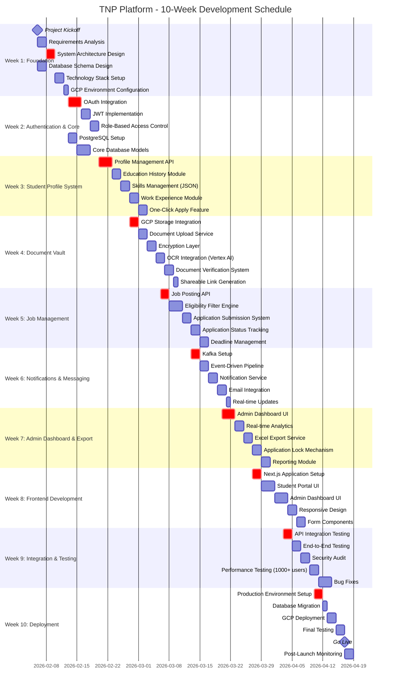
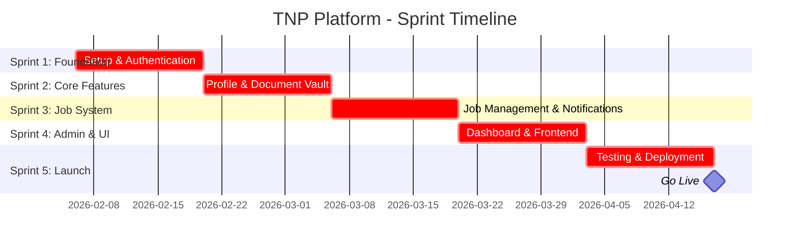
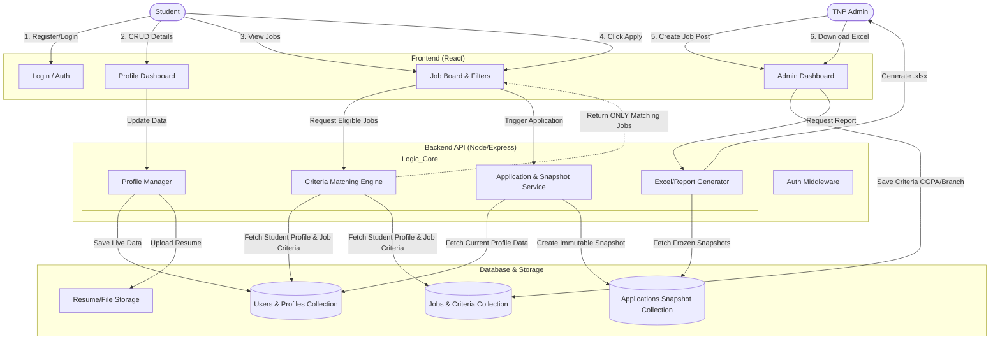

# Training & Placement Management Platform

> A centralized, cloud-native SaaS platform designed to streamline campus recruitment processes with secure document management, intelligent job matching, and automated administrative workflows.

**Tech Stack**: Next.js, TypeScript, Microservices, PostgreSQL, Kafka, GCP Storage, Vertex AI  
**Project Duration**: 10 weeks (70 days)

---

## Project Timeline



---

## Sprint Overview



---

## System Architecture



---

## Project Phases

| Phase | Key Deliverables | Duration | Status |
|-------|-----------------|----------|--------|
| Week 1: Foundation | Architecture, DB Schema, GCP Setup | 7 days | Pending |
| Week 2: Authentication | OAuth, JWT, RBAC, Database Models | 7 days | Pending |
| Week 3: Profile System | Profile Management, Skills, One-Click Apply | 7 days | Pending |
| Week 4: Document Vault | Secure Storage, OCR, Verification | 7 days | Pending |
| Week 5: Job Management | Job Posting, Eligibility Filters, Applications | 7 days | Pending |
| Week 6: Notifications | Kafka, Event Pipeline, Email Integration | 7 days | Pending |
| Week 7: Admin Dashboard | Analytics, Excel Export, Reporting | 7 days | Pending |
| Week 8: Frontend | Next.js UI, Student & Admin Portals | 7 days | Pending |
| Week 9: Testing | Integration, Security, Performance Testing | 7 days | Pending |
| Week 10: Deployment | Production Setup, GCP Deployment, Go Live | 7 days | Pending |

---

## Key Features

### Student Portal
- Comprehensive profile management with education history and skills tracking
- Secure document vault with OCR-powered verification
- One-click job application using stored profile data
- Real-time application status tracking
- Automated deadline notifications

### Admin Dashboard
- Job posting with customizable eligibility criteria
- Real-time applicant statistics and analytics
- One-click Excel export of applicant data
- Application deadline management and locking
- Comprehensive placement analytics and reporting

### Security & Compliance
- End-to-end encryption for all documents
- OAuth-based authentication with JWT tokens
- Role-based access control (RBAC)
- Audit logs for all document access
- Compliance with Indian data protection regulations

---

## Technology Stack

| Layer | Technology | Purpose |
|-------|-----------|---------|
| Frontend | Next.js, TypeScript | UI rendering, forms, student/admin portals |
| Backend | Microservices | Core APIs, authentication, data exports |
| Database | PostgreSQL | Profiles, jobs, applications storage |
| Storage | GCP Storage | Secure encrypted document vault |
| Messaging | Kafka | Event-driven notifications |
| AI Services | Vertex AI | OCR, skill matching, document verification |
| Cloud Platform | Google Cloud Platform | Hosting, scalability, security |

---

## Key Milestones

| Milestone | Date | Description |
|-----------|------|-------------|
| Project Kickoff | Feb 6, 2026 | Requirements finalization and team setup |
| Authentication Complete | Feb 19, 2026 | OAuth, JWT, and RBAC implemented |
| Profile System Ready | Feb 26, 2026 | Student profile management functional |
| Document Vault Live | Mar 5, 2026 | Secure storage with OCR operational |
| Job System Complete | Mar 12, 2026 | Job posting and application system ready |
| Notifications Active | Mar 19, 2026 | Kafka-based event pipeline functional |
| Admin Dashboard Ready | Mar 26, 2026 | Analytics and export features complete |
| Frontend Complete | Apr 2, 2026 | All UI components implemented |
| Testing Complete | Apr 9, 2026 | Security and performance validated |
| Production Launch | Apr 17, 2026 | Platform goes live |

---

## Non-Functional Requirements

### Performance
- Support 1000+ concurrent users
- Page load time under 3 seconds
- Real-time notification delivery
- Scalable microservices architecture

### Security
- AES-256 encryption for documents at rest
- TLS 1.3 for data in transit
- Comprehensive access logging
- Regular security audits
- Protected against unauthorized downloads

### Scalability
- Horizontal scaling via microservices
- Cloud-native architecture on GCP
- Event-driven messaging with Kafka
- Optimized database indexing

---

## Getting Started

### Prerequisites
- Node.js 18+
- PostgreSQL 15+
- GCP Account
- Kafka

### Installation
```bash
# Clone the repository
git clone https://github.com/your-org/tnp-platform.git

# Install frontend dependencies
cd frontend
npm install

# Setup environment variables
cp .env.example .env

# Run database migrations
npm run migrate

# Start development servers
npm run dev
```

---

## Project Information

**Project Start**: February 6, 2026  
**Expected Completion**: April 17, 2026  
**Total Duration**: 10 weeks (70 days)  
**Development Team**: Full-stack developers, DevOps engineers, QA testers  
**Target Users**: 1000+ students, TPO administrators, external recruiters

---

## License

This project is proprietary software developed for academic institutions.

---

## Contact

For questions or support, please contact the development team or project administrators.
